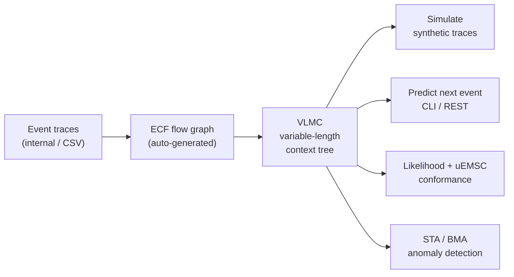

<div align="center">

# 🧠 REMEMBER

**Learn _interpretable_ Variable-Length Markov Chains from event traces — then simulate, predict, score, and detect anomalies.**


</div>

---

## What is REMEMBER?

**REMEMBER** turns sequences of events — application logs, process-mining event logs, system
traces — into a compact, **interpretable** probabilistic model: a **Variable-Length Markov Chain
(VLMC)** whose memory length *adapts to the data*. Contexts that carry predictive information are
kept deep; contexts that don't are pruned away. The result is a small tree you can actually read,
not a black box.

Once the model is learned, REMEMBER lets you **generate** new traces, **predict** the next event,
**measure** how well a log conforms to the model, and **flag** anomalous behaviour.

> [!NOTE]
> REMEMBER is implemented as the `jfitvlmc` multi-module Maven project. You will see the name
> `jfitvlmc` in build paths and in the JAR filename — that is the implementation artifact; the
> tool itself is **REMEMBER**.

### Who is it for?

| If you… | …REMEMBER gives you |
|---------|---------------------|
| Run services that emit logs and want to **understand normal behaviour** | A readable model of what usually follows what |
| Do **process mining** on CSV event logs | VLMC learning directly from `case_id / activity / timestamp` |
| Need to **detect anomalies** in execution traces (e.g. HDFS, BGL) | STA + Online Bayesian Model Averaging, with ready-made benchmarks |
| Want **synthetic data** that mimics a real log | A simulator that samples from the learned distribution |
| Need a **next-event predictor** behind an API | A built-in HTTP REST endpoint |

### What it does, at a glance



- **Simulation** — generate new synthetic traces that follow the learned distribution.
- **Prediction** — given a context, return the probability distribution over the next event
  (also exposed as an HTTP REST endpoint).
- **Likelihood & conformance** — per-trace / per-prefix likelihood plus **uEMSC** (unit Earth
  Mover's Stochastic Conformance), a `[0, 1]` score of how well the log conforms to the model.
- **Anomaly detection** — **STA (Stochastic Tree Attention)** mixes contexts of different depths
  with a softmax attention, optionally updated online with **Bayesian Model Averaging (BMA)**.
  Ready-made benchmarks for the HDFS and BGL log datasets are included.

---

## Table of contents

1. [Quickstart](#quickstart)
2. [Concepts in 60 seconds](#concepts-in-60-seconds)
3. [Requirements & build](#requirements--build)
4. [Hello World — a synthetic dataset](#hello-world--a-synthetic-dataset)
5. [Input formats](#input-formats)
6. [Parameter reference](#parameter-reference)
7. [Output files explained](#output-files-explained)
8. [Prediction & REST API](#prediction--rest-api)
9. [Anomaly detection (STA / BMA) and benchmarks](#anomaly-detection-sta--bma-and-benchmarks)
10. [Project layout](#project-layout)
11. [Testing](#testing)
12. [Known issues](#known-issues)

---

## Quickstart

```bash
# 1. Build the runnable JAR (from the repository root)
mvn clean package -DskipTests

# 2. Create a convenient alias
export JAR=jfitvlmc/target/jfitvlmc-1.0.0-SNAPSHOT-jar-with-dependencies.jar
alias remember="java -jar $JAR"

# 3. Learn a model from traces and simulate 5 new ones
remember --infile traces.txt --vlmcfile model.vlmc --alfa 0.05 --nsim 5
```

> [!TIP]
> New to Variable-Length Markov Chains? Read [Concepts in 60 seconds](#concepts-in-60-seconds),
> then follow the fully worked [Hello World](#hello-world--a-synthetic-dataset) tutorial below —
> every command and every output in it is real and verified end-to-end.

---

## Concepts in 60 seconds

- **VLMC** — a Markov chain whose order is *not* fixed. A fixed-order Markov chain of order *k*
  remembers exactly the last *k* symbols everywhere; a VLMC remembers *as much as needed*:
  some states only depend on the immediately preceding symbol, others on a longer suffix. This
  is modelled as a tree of contexts, each holding a next-symbol probability distribution.
- **Pruning (`--alfa`)** — the tree is grown deep and then statistically pruned: a child context
  is kept only if its next-symbol distribution differs *significantly* (chi-square test at level
  `alfa`) from its parent. Higher `alfa` ⇒ more aggressive growth (deeper tree); lower `alfa` ⇒
  smaller, more general model.
- **ECF** — an intermediate flow graph (nodes = events, edges = observed transitions) that the
  tool builds automatically from your traces (or you can supply your own `.ecf`). The VLMC is
  grown by navigating this graph.
- **`end$`** — the reserved terminal symbol that marks the end of one trace. Everything between
  two `end$` tokens is one independent sequence.
- **uEMSC** — stochastic conformance: 1.0 = the model reproduces the log's trace distribution
  perfectly, 0.0 = no overlap.

---

## Requirements & build

| Requirement | Version |
|-------------|---------|
| JDK         | **17+** |
| Maven       | **3.x** |

```bash
# from the repository root (multi-module reactor: ecf/ + jfitvlmc/)
mvn -version          # confirm Maven 3.x + Java 17
mvn clean package -DskipTests   # builds the fat JAR
```

The runnable artifact (all dependencies bundled) is:

```
jfitvlmc/target/jfitvlmc-1.0.0-SNAPSHOT-jar-with-dependencies.jar
```

For convenience the rest of this guide uses a shell alias:

```bash
export JAR=jfitvlmc/target/jfitvlmc-1.0.0-SNAPSHOT-jar-with-dependencies.jar
alias remember="java -jar $JAR"
```

---

## Hello World — a synthetic dataset

We model a tiny **e-commerce session**: users `login`, then `browse`/`search`, sometimes
`addcart`, occasionally `checkout` + `pay`, and finally `logout`. The next action depends on
*how* you got to the current one (variable-length memory), which is exactly what a VLMC captures.

### 1. Generate the dataset

Each trace is a space-separated sequence of events terminated by `end$`. The whole file is one
token stream (newlines are ignored — keep tokens space-separated). This snippet creates 300
traces:

```bash
mkdir -p /tmp/vlmc_hello && cd /tmp/vlmc_hello
python3 - <<'PY'
import random
random.seed(42)
traces = []
for _ in range(300):
    seq = ["login"]
    for _ in range(random.randint(1, 3)):
        seq.append(random.choice(["browse", "search"]))
    if random.random() < 0.7:
        seq.append("addcart")
        if random.random() < 0.6:
            seq += ["checkout", "pay"]      # purchase
        else:
            seq.append("browse")            # cart abandoned
    seq += ["logout", "end$"]
    traces.append(" ".join(seq))
open("traces.txt", "w").write(" ".join(traces) + " ")
PY
```

A couple of resulting traces:

```
login browse browse search addcart checkout pay logout end$
login browse logout end$
```

### 2. Learn the VLMC (+ auto-generate the ECF + simulate)

```bash
remember --infile traces.txt \
         --vlmcfile model.vlmc \
         --ecfoutfile model.ecf \
         --alfa 0.05 \
         --nsim 5 --outfile sim_output.mat
```

This produces three files: `model.vlmc` (the learned model), `model.ecf` (the flow graph the
tool built from the traces), and `sim_output.mat` (5 simulated traces).

### 3. Read the model

`model.vlmc` is a human-readable indented tree. Each line is:

```
"context"-{[prob,"nextSymbol"] ...  -observationCount}
```

Indentation means "extend the context one symbol *into the past*". Excerpt of the actual output:

```
"root"-{-0}
	"login"-{[0.503333,"browse"][0.496667,"search"]-300}
	"browse"-{[0.174603,"browse"][0.206349,"search"][0.280423,"addcart"][0.338624,"logout"]-378}
		"login"-{[0.311258,"browse"][0.364238,"search"][0.238411,"addcart"][0.086093,"logout"]-151}
	"checkout"-{[1.000000,"pay"]-127}
	"pay"-{[1.000000,"logout"]-127}
	"logout"-{[1.000000,"end$"]-300}
```

How to read it:

- After `login`, the next event is `browse` ~50% / `search` ~50% of the time.
- `checkout` is *always* (prob 1.0, 127 observations) followed by `pay`, and `pay` always by
  `logout` — the model discovered the deterministic purchase tail.
- `browse` on its own has one distribution, but `browse` **preceded by** `login`
  (the indented `"login"` child) has a *different* one — this is the variable-length memory at
  work. If the two distributions had been statistically indistinguishable at `alfa=0.05`, the
  child would have been pruned and `browse` would keep a single order-1 distribution.

### 4. Inspect the simulated traces

`sim_output.mat` (comma + empty-field separated, one trace per line):

```
addcart,,browse,,logout,,end$
addcart,,checkout,,pay,,logout,,end$
```

### 5. Score the log: likelihood + uEMSC

```bash
remember --vlmc model.vlmc --ecf model.ecf --lik traces.txt
```

Aggregated stdout (real output):

```
=== LIKELIHOOD ANALYSIS ===
Total traces: 300
Traces with non-zero likelihood: 300
Aggregate log-likelihood: -1058.610428
Distinct traces: 42
uEMSC (stochastic conformance): 0.949345
```

A uEMSC of **0.95** says the learned model reproduces the trace distribution of the log almost
perfectly — expected, since we trained and scored on the same data. Two CSV files are also
written (basename = input file name without extension):

`traces.lik` — one row per trace:

```
trace_id,trace_length,likelihood,log_likelihood
0,9,1.582549e-02,-4.146133
1,7,7.121503e-02,-2.642051
```

`traces.lik.prefix` — one row per prefix, with the predicted next event and the full distribution:

```
trace_id,prefix_length,likelihood,prefix,next_activity,possible_activities
0,3,2.999990e-02,login browse browse,search,browse:0.2128;search:0.1915;addcart:0.4255;logout:0.1702
0,5,1.582549e-02,login browse browse search addcart,checkout,checkout:0.5935;browse:0.4065
```

That's the full loop: **learn → simulate → score**, all verified end-to-end.

---

## Input formats

The input file is auto-detected. Two formats are supported.

### 1. Internal (legacy) format

Plain text, events separated by spaces, each trace terminated by the reserved token `end$`:

```
login browse addcart checkout pay logout end$ login search logout end$ ...
```

> [!NOTE]
> The whole file is read as one token stream; line breaks are **not** significant, so keep events
> space-separated across line boundaries. If an event name contains `_` followed by a number
> (e.g. `task_5`), the trailing number is parsed as an edge **cost** in the generated ECF; a
> non-numeric suffix is ignored.

### 2. CSV event log (process-mining format)

A file is treated as CSV when it ends in `.csv` **or** any `--csv-*` option is set. It must have
a header with at least three columns: a **case id**, an **activity**, and a **timestamp**. Rows
are grouped by case id and ordered by timestamp to reconstruct each trace.

```csv
case_id,activity,timestamp
case0,login,2026-01-01T00:00:01
case0,browse,2026-01-01T00:00:02
case0,addcart,2026-01-01T00:00:03
```

```bash
remember --infile log.csv \
         --csv-case case_id --csv-activity activity --csv-timestamp timestamp \
         --vlmcfile model.vlmc --alfa 0.05 --nsim 1
```

Column names default to `case_id` / `activity` / `timestamp` and the separator to `,`; override
with `--csv-case`, `--csv-activity`, `--csv-timestamp`, `--csv-separator`.

---

## Parameter reference

Run `remember --help` for the built-in list. Below is the *meaning* and *how to choose* each flag.

> [!IMPORTANT]
> `--alfa` is the single most important knob — it controls model size vs. detail. **Higher
> `alfa` (e.g. 0.1) → deeper tree, more contexts, longer memory, risk of overfitting. Lower
> `alfa` (e.g. 0.01) → smaller, more general model, risk of underfitting.** Typical range
> 0.01–0.05; start at **0.05**.

### Core learning

| Flag | Default | Meaning & how to use |
|------|---------|----------------------|
| `--infile <file>` | — | **Required for learning.** The trace file (internal or CSV). |
| `--alfa <float>` | — | **Required for learning.** Significance level of the chi-square pruning test. See the callout above. |
| `--vlmcfile <file>` | `model.vlmc` | Where the learned model is written. |
| `--maxdepth <int>` | 25 | Maximum context depth explored while navigating the ECF graph (longest memory the model may consider). Raise it only if your sequences have genuinely long-range dependencies; it bounds runtime/memory. |
| `--ecf <file>` | auto | Supply a pre-built ECF flow graph instead of letting the tool generate one from the traces. |
| `--ecfoutfile <file>` | — | Save the auto-generated ECF graph (useful for inspection or to ship alongside the model). |

<details>
<summary><strong>Simulation, scoring/prediction, CSV & misc flags</strong> (click to expand)</summary>

#### Simulation

| Flag | Default | Meaning & how to use |
|------|---------|----------------------|
| `--nsim <int>` | 1 | Number of synthetic traces to sample from the learned model. Use a large value (e.g. 1000) to generate a representative synthetic log. |
| `--outfile <file>` | `simulation_output.mat` | Where simulated traces are written. |
| `--ntime <int>` | 1 | Auxiliary time parameter used during processing. Leave at the default unless you know you need it. |
| `--rnd` | off | Generate a *randomized* VLMC derived from an existing model (perturbed distributions) rather than learning from data. |

#### Scoring / prediction

| Flag | Default | Meaning & how to use |
|------|---------|----------------------|
| `--vlmc <file>` | — | Load a pre-trained model instead of learning. Pair with `--lik`, `--pred`, or `--pred_rest`. |
| `--lik <file>` | — | Compute per-trace & per-prefix likelihood plus aggregate log-likelihood and uEMSC for the traces in `<file>`. |
| `--pred` | off | One-shot prediction mode. Requires `--initCtx` (and currently also `--ecf`, see [Known issues](#known-issues)). |
| `--initCtx <ctx>` | — | The starting context for prediction, e.g. `"login browse"` (space-separated). |
| `--pred_rest <port>` | — | Start the HTTP prediction server on the given port (1–65535). |

#### CSV options

| Flag | Default | Meaning |
|------|---------|---------|
| `--csv-case <name>` | `case_id` | Column holding the trace/case identifier. |
| `--csv-activity <name>` | `activity` | Column holding the event/activity name. |
| `--csv-timestamp <name>` | `timestamp` | Column used to order events within a case. |
| `--csv-separator <char>` | `,` | Field separator. |

#### Misc

| Flag | Meaning |
|------|---------|
| `-h`, `--help` | Show the built-in help banner. |

</details>

---

## Output files explained

| File | Produced by | Format |
|------|-------------|--------|
| `*.vlmc` | learning | Indented context tree: `"context"-{[prob,"sym"]…-count}`. Child lines extend the context one symbol into the past. |
| `*.ecf` | `--ecfoutfile` / auto | `FLOW{ edge X{ cost…; in…; out…; } … }` — the flow graph of observed transitions. |
| `*.mat` | simulation | One simulated trace per line, fields separated by `,,`. |
| `<base>.lik` | `--lik` | `trace_id,trace_length,likelihood,log_likelihood`. |
| `<base>.lik.prefix` | `--lik` | `trace_id,prefix_length,likelihood,prefix,next_activity,possible_activities`. The last column lists every candidate next event with its probability. |

> [!NOTE]
> The `--lik` output basename is the input file name **with its extension stripped** — scoring
> `traces.txt` writes `traces.lik`, not `traces.txt.lik`.

---

## Prediction & REST API

Start a server that answers next-event queries over HTTP:

```bash
remember --vlmc model.vlmc --pred_rest 8080
# query: context symbols joined by '-'
curl "http://localhost:8080/?ctx=login-browse"
```

The handler walks the VLMC to the deepest matching context and returns the next-symbol
distribution for `ctx`.

---

## Anomaly detection (STA / BMA) and benchmarks

The `sta` package treats a *low-likelihood* trace as anomalous, but improves on plain VLMC by
**mixing contexts of different depths**:

- **Static STA** (`StaPredictor.predict`) — collects all matched contexts from the root down,
  weights them with a softmax over the score `log(max(1,n)) · KL_divergence` (temperature
  `beta`), and mixes their distributions. Larger `beta` sharpens attention onto the most
  informative contexts.
- **Online BMA** (`StaPredictor.predictOnline`) — updates the context weights Bayesianly at every
  step: `w_i ← (1-η)·w_i·P_i(s_t)/P_mix(s_t) + η/K`. The **fixed-share** term `η > 0`
  (Herbster & Warmuth 1998) prevents "weight death" so the mixture can recover when the active
  context set changes.

### HDFS benchmark

```bash
java -cp $JAR sta.HdfsFullBenchmark \
     --raw-log HDFS.log --labels anomaly_label.csv \
     --eta 0.05 --save-vlmc hdfs.vlmc --output hdfs_results.csv
```

Sessions are reconstructed by **BlockId** extracted from the raw log; the benchmark compares
classic VLMC vs static STA vs Online BMA across a sweep of `beta` values and prints a P/R/F1
table plus a CSV report. Key flags: `--raw-log` / `--structured-log`, `--labels`, `--alfa`,
`--eta`, `--vlmc-model` (skip training), `--save-vlmc`, `--output`.

### BGL benchmark

BGL (Blue Gene/L) logs have no per-request id, so sessions are built as **fixed-size sliding
windows**:

```bash
java -cp $JAR sta.BglFullBenchmark \
     --bgl-log BGL.log --window-size 20 \
     --eta 0.05 --save-vlmc bgl.vlmc --output bgl_results.csv
```

`BglLogParser` derives each event as `component+level` (fields 8 and 9 of a log line), groups
events into windows of `--window-size` (default 20), and labels a window anomalous if any of its
lines carries a label other than `-`. Same VLMC-vs-STA-vs-BMA comparison and auto-beta heuristic
as the HDFS benchmark.

---

## Project layout

```
REMEMBER (jfitVLMC repo)
├── ecf/                     # ECF module: ANTLR parser + Flow/Edge/ECFListener data structures
└── jfitvlmc/                # Core module
    └── src/main/java/
        ├── fitvlmc/         # CLI entry point (fitVlmc), ECF navigation, log parsers (HDFS/BGL/CSV), REST
        ├── vlmc/            # VLMC data structures: VlmcRoot, VlmcNode, distributions, walker
        ├── sta/             # Stochastic Tree Attention, Online BMA, anomaly scoring, benchmarks
        └── suffixarray/     # SuffixArray (SA-IS, O(n)) and SuffixArrayInt (with LCP)
```

`jfitvlmc` depends on `ecf` via the reactor build — no separate install needed. Main entry point:
`fitvlmc.fitVlmc`. See [`CLAUDE.md`](CLAUDE.md) for the full class-by-class reference.

---

## Testing

```bash
mvn test         # 170 unit tests (excludes @Tag("e2e"))
mvn verify       # adds 7 e2e tests via the Failsafe plugin (177 total)
```

End-to-end tests are tagged `@Tag("e2e")` (currently `EndToEndTest` and `SuffixArrayPerfTest`).

Quality gates: Spotless (Google Java Format / AOSP), SpotBugs, and JaCoCo (≥35% line coverage)
run under `mvn verify`.

---

## Known issues

> [!WARNING]
> **`--pred` without `--ecf` throws an NPE.** In prediction mode the tool still tries to generate
> an ECF, so `remember --vlmc model.vlmc --pred --initCtx "A"` crashes. **Workaround:** also pass
> `--ecf model.ecf`. Tracking issue:
> [#8](https://github.com/bistrulli/remember2.0/issues/8).
